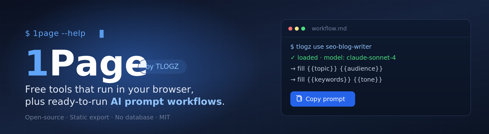

<div align="center">



# 1Page

### The open-source home of [TLOGZ](https://tlogz.top)

**21 free browser tools + 28 ready-to-run AI prompt workflows.**
_AI is Easy._

[](https://tlogz.top)
[](https://tools.tlogz.top)
[](https://tlogz.top/workflows/)

</div>

<div align="center">


</div>

---

## ✨ What is 1Page?

**1Page** is the open-source repository behind **[TLOGZ](https://tlogz.top)** — the complete platform of **free browser tools** and **ready-to-run AI prompt workflows**.

Everything runs **client-side**: no sign-up, no uploads, no accounts, no tracking. Your text and numbers stay on your device. Fork it, build it, deploy the static output anywhere.

> **One repo, two pillars.**
> 🧰 **Free tools** — text, math, health, security, developer, design, creator and utility tools that run entirely in your browser.
> 🧠 **AI prompt workflows** — structured, fill-in-the-blank prompts you copy and paste into ChatGPT, Claude, or Gemini.

Both pillars live as plain, versioned content in [`content/`](content/) — a single source of truth for the whole platform.

---

## 🚀 Live Network

| Product | What it is | Link |
| --- | --- | --- |
| 🌐 **TLOGZ** | Free browser tools + AI prompt workflows | [tlogz.top](https://tlogz.top) |
| 🔧 **Tools** | 100+ free online tools across 15+ categories | [tools.tlogz.top](https://tools.tlogz.top) |
| 🇧🇩 **Zero** | Bangla-language toolbox (PDF, photos, typing, tax) | [zero.tlogz.top](https://zero.tlogz.top) |
| ✍️ **Blog** | Where Words Live — marketing, SEO, tech & trends | [tlogz.com](https://tlogz.com) |

---

## 🧰 Free Tools

<details open>
<summary><b>Browse all 21 tools</b> — catalog in <a href="content/tools/tools.json"><code>content/tools/tools.json</code></a></summary>

**Text**
- [Case Converter](https://tlogz.top/tools/case-converter/) — UPPERCASE, lowercase, Title Case, camelCase, snake_case and more.
- [Word Counter](https://tlogz.top/tools/word-counter/) — words, characters, sentences, paragraphs + reading time.
- [Find and Replace](https://tlogz.top/tools/find-and-replace/) — replace every match, with case & regex options.
- [Character Counter](https://tlogz.top/tools/character-counter/) — check against limits for X, SEO meta, SMS, Instagram.
- [Remove Duplicate Lines](https://tlogz.top/tools/remove-duplicate-lines/) — dedupe a list, order preserved.
- [Sort Lines](https://tlogz.top/tools/sort-lines/) — sort alphabetically, numerically, by length, or shuffle.
- [Text to Slug](https://tlogz.top/tools/text-to-slug/) — clean lowercase URL slugs, accents removed.

**Math**
- [Percentage Calculator](https://tlogz.top/tools/percentage-calculator/) — three everyday percentage calculations.
- [Unit Converter](https://tlogz.top/tools/unit-converter/) — length, weight, volume, temperature.
- [Age Calculator](https://tlogz.top/tools/age-calculator/) — exact age + birthday countdown.
- [Roman Numeral Converter](https://tlogz.top/tools/roman-numeral-converter/) — numbers ↔ Roman numerals (1–3999).

**Health**
- [BMI Calculator](https://tlogz.top/tools/bmi-calculator/) — BMI + healthy weight range.

**Security**
- [Password Generator](https://tlogz.top/tools/password-generator/) — strong passwords, generated in-browser, never sent.

**Developer**
- [JSON Formatter & Validator](https://tlogz.top/tools/json-formatter/) — format, minify, or validate JSON.
- [Base64 Encoder/Decoder](https://tlogz.top/tools/base64-encoder-decoder/) — full accents & emoji support.
- [Unix Timestamp Converter](https://tlogz.top/tools/unix-timestamp-converter/) — epoch ↔ dates.
- [JSON to CSV](https://tlogz.top/tools/json-to-csv/) — JSON array → CSV for Excel/Sheets.

**Design**
- [Lorem Ipsum Generator](https://tlogz.top/tools/lorem-ipsum-generator/) — paragraphs, sentences, or words.
- [HEX to RGB](https://tlogz.top/tools/hex-rgb-color-converter/) — HEX → RGB/HSL with a visual picker.

**Creator**
- [YouTube Chapter Formatter](https://tlogz.top/tools/youtube-chapter-formatter/) — times + topics → chapters.

**Utility**
- [WiFi QR Code Generator](https://tlogz.top/tools/wifi-qr-code-generator/) — guests scan to join your WiFi.

</details>

---

## 🧠 AI Prompt Workflows

<details>
<summary><b>Browse all 28 prompts</b> — catalog in <a href="content/workflows/workflows.json"><code>content/workflows/workflows.json</code></a></summary>

**ChatGPT (3)** — Conversational Tutor · GPT Builder Configurator · Prompt Library Manager
**Claude (2)** — Document Analyzer · Knowledge Base Builder
**Content (4)** — E-Commerce Product Copywriter · Newsletter Content Creator · Press Release & PR Writer · Video Script Writer
**Development (4)** — Code Review & Refactoring · Database Schema & SQL Builder · Full-Stack CRUD API Generator · React Component Generator
**Education (2)** — Lesson Plan & Curriculum Designer · Quiz & Assessment Generator
**Freelancing (2)** — Client Proposal & Pitch Builder · Freelance Brand & Portfolio Kit
**Gemini (2)** — Multimodal Analyzer · Research Synthesizer
**Marketing (5)** — Competitor & Market Research · Email Campaign Builder · Facebook Ad Generator · Multi-Platform Ad Copy Generator · Social Media Content Calendar
**SEO (3)** — Keyword Research & Clustering · Link Building Outreach · Technical SEO Audit
**Writing (1)** — SEO Blog Post Writer

👉 Full library with interactive fill-in forms: [tlogz.top/workflows](https://tlogz.top/workflows/)

</details>

---

## 🎯 Key Features

| | Feature | What it means |
| --- | --- | --- |
| 🔒 | **Privacy-first** | Everything runs in the browser. Nothing you type is ever uploaded. |
| 🔎 | **Instant search** | Client-side fuzzy search (Fuse.js) across tools and workflows — no server. |
| 📋 | **Copy & run** | Every workflow ships a complete prompt with fill-in-the-blank variables. |
| 🧩 | **Anyone can contribute** | Submit tools and prompts via Issue, Discussion, or Pull Request — no coding required. |
| 🌐 | **SEO optimized** | Every tool, workflow, category and tag has its own indexable page. |
| ⚡ | **Zero backend** | Fully static export. No database, no server, no runtime dependencies. |
| 🎨 | **Modern UI** | Tailwind CSS, GitHub-inspired dark theme, JetBrains Mono accents. |
| 📖 | **Open source** | Every line of code and every prompt is public and MIT licensed. |

---

## 🏗️ Architecture

```
Content (JSON + Markdown)  →  content/tools · content/workflows · content/settings
        │
        ▼
Build scripts parse content & generate JSON indices  →  public/*.json
        │
        ▼
Next.js static export  →  out/  (a folder of ready-to-serve files)
        │
        ▼
Deploy to any static host  →  visitors search, browse, and copy
```

| Layer | Technology |
| --- | --- |
| Source of truth | [This GitHub repository](https://github.com/soms3r/1page) |
| Content format | JSON catalogs + Markdown/YAML workflows |
| Framework | [Next.js](https://nextjs.org/) — static export (`output: 'export'`) |
| Styling | [Tailwind CSS](https://tailwindcss.com/) |
| Search | [Fuse.js](https://fusejs.io/) (in-browser, no server) |
| Markdown | react-markdown + remark-gfm + rehype-sanitize |
| Analytics | Umami (optional, browser-only) |
| Database | **None** |

---

## 📁 Directory Structure

```
content/
  tools/
    tools.json                 # Catalog of all 21 free tools
  workflows/
    workflows.json             # Catalog of all 28 AI prompt workflows
    marketing/facebook-ad-generator.md
    writing/seo-blog-post-writer.md
    development/react-component-generator.md
    chatgpt/chatgpt-conversational-tutor.md
  settings/
    site.json                  # Site-wide metadata

src/
  app/  components/  lib/  scripts/     # Next.js app + build scripts

public/                 # Generated JSON (after build)
out/                    # Final static site (generated — deploy this)
assets/                 # README banner & static media
docs/                   # DEPLOYMENT.md · MIGRATION.md
```

---

## ⚡ Quick Start

```bash
# 1. Clone
git clone https://github.com/soms3r/1page.git
cd 1page

# 2. Install
npm install

# 3. Build
npm run build

# 4. Serve locally
npm start
```

Open **http://localhost:3000** — that's it. No database, no environment variables, no server setup.

### Available Scripts

| Command | What it does |
| --- | --- |
| `npm run dev` | Start the dev server with hot reload |
| `npm run build` | Full build: generate indices → static export → copy assets |
| `npm start` | Serve the built site locally (from `out/`) |
| `npm run build-index` | Regenerate JSON indices only |
| `npm run lint` | Lint the codebase |

---

## 🚢 Deployment

1Page is a fully static site. The `out/` folder goes anywhere.

<details>
<summary><b>Shared hosting (Apache / cPanel)</b></summary>

Upload the `out/` folder via FTP and add an `.htaccess` for clean URLs:

```apache
RewriteEngine On
RewriteCond %{REQUEST_FILENAME} !-f
RewriteCond %{REQUEST_FILENAME} !-d
RewriteRule ^(.*)$ $1/index.html [L]
```

</details>

<details>
<summary><b>GitHub Pages</b></summary>

```yaml
name: Deploy to GitHub Pages
on:
  push:
    branches: [main]
permissions:
  contents: read
  pages: write
  id-token: write
jobs:
  build-and-deploy:
    runs-on: ubuntu-latest
    steps:
      - uses: actions/checkout@v4
      - uses: actions/setup-node@v4
        with:
          node-version: 20
      - run: npm ci
      - run: npm run build
      - uses: actions/upload-pages-artifact@v3
        with:
          path: out/
      - uses: actions/deploy-pages@v4
```

</details>

<details>
<summary><b>Netlify / Cloudflare Pages / Vercel</b></summary>

- **Build command:** `npm run build`
- **Publish / output directory:** `out`

</details>

> Full walkthrough: [docs/DEPLOYMENT.md](docs/DEPLOYMENT.md).

---

## 📝 Content Format

### Tools — `content/tools/tools.json`

Each tool is a JSON entry:

```json
{
  "slug": "word-counter",
  "title": "Word Counter",
  "tag": "TXT",
  "category": "text",
  "description": "Count words, characters, sentences and paragraphs as you type.",
  "url": "https://tlogz.top/tools/word-counter/",
  "clientSide": true
}
```

### Workflows — `content/workflows/<category>/<slug>.md`

Each workflow is a Markdown file with a YAML header:

```markdown
---
title: "Facebook Ad Generator"
slug: facebook-ad-generator
description: "Create high-converting Facebook ad copy with structured prompts."
category: marketing
tags: [facebook, ads, copywriting]
models:
  best: claude-sonnet-4
  good: [gpt-4o, gemini-2.5-pro]
updated: 2026-10-09
featured: true
variables:
  - name: product
    label: Product / Service
    required: true
    placeholder: "e.g. BudgetTracker Pro"
---

You are a direct-response copywriter. Write a Facebook ad for:

**Product**: {{product}}
**Audience**: {{audience || "small business owners"}}
```

| Field | Required | Description |
| --- | --- | --- |
| `title` | ✅ | Human-readable name |
| `slug` | ✅ | URL-friendly id (lowercase, hyphens) |
| `description` | ✅ | One-line summary shown in search |
| `category` | ✅ | `marketing` · `development` · `writing` · `chatgpt` · `claude` · `gemini` · `content` · `seo` · `education` · `freelancing` |
| `tags` | — | Keywords for filtering |
| `models.best` / `good` / `limited` | — | Recommended AI models |
| `updated` | ✅ | ISO date (`YYYY-MM-DD`) |
| `featured` | — | `true` to show on the featured page |
| `variables` | — | Input fields with labels & placeholders |

**Variables:** use `{{name}}` for inputs and `{{var || "default"}}` for optional values with a fallback.

---

## 🤝 How to Contribute

Everyone is welcome — you don't need to code.

| I want to… | Do this | Skill |
| --- | --- | --- |
| Submit a tool or a prompt | Open a [New Issue](https://github.com/soms3r/1page/issues/new/choose) | Anyone |
| Share for feedback | Start a [Discussion](https://github.com/soms3r/1page/discussions) | Anyone |
| Improve content | Edit a file in `content/` and open a PR | Anyone |
| Fix a bug / add a feature | Fork → branch → [Pull Request](https://github.com/soms3r/1page/pulls) | Developer |

See **[CONTRIBUTING.md](CONTRIBUTING.md)** for details. **No contribution is too small** — a single tool or prompt can help hundreds of people.

---

## 🗺️ Roadmap

- [x] Unified content source for **tools + prompts**
- [x] Static-first architecture (no backend, no database)
- [x] Client-side search across tools & workflows
- [x] SEO: per-tool, per-workflow, per-tag pages + sitemap
- [x] 100+ free browser tools ([tools.tlogz.top](https://tools.tlogz.top))
- [x] Bangla-language toolbox ([zero.tlogz.top](https://zero.tlogz.top))
- [ ] Community voting & contributor leaderboard
- [ ] Multilingual UI & content support
- [ ] Browser extension for quick access
- [ ] Public API for programmatic access

---

## ❓ FAQ

**Do I need an account?** No. The site is fully static — no signup, no login, no tracking.
**Is there a database?** No. Everything is content in this repo, built at deploy time.
**Can I run my own copy?** Yes. Fork it, `npm run build`, and deploy `out/` anywhere.
**Which AI models work?** Any. Workflows *recommend* models, but paste them into any tool.
**Can I use this commercially?** Yes — MIT licensed. Use it however you like.

---

## 👥 Credits & Maintainers

1Page is designed, built, and maintained by:

<table>
  <tr>
    <td align="center" width="50%">
      <a href="https://github.com/tbahsan">
        
      </a>
      <br/>
      <a href="https://github.com/tbahsan"><b>Tasneem Bin Ahsan</b></a>
      <br/>
      <sub>🎨 Creator of TLOGZ · Web Designer &amp; Developer · Bengali poet</sub>
      <br/>
      <a href="https://github.com/tbahsan"><code>@tbahsan</code></a> ·
      <a href="https://tlogz.com">tlogz.com</a>
    </td>
    <td align="center" width="50%">
      <a href="https://github.com/soms3r">
        
      </a>
      <br/>
      <a href="https://github.com/soms3r"><b>Somser Ali</b></a>
      <br/>
      <sub>🛠️ Lead Maintainer · Open-source tooling · OSINT &amp; research tools</sub>
      <br/>
      <a href="https://github.com/soms3r"><code>@soms3r</code></a> ·
      <a href="https://github.com/TBA-OpenIntel">TBA-OpenIntel</a>
    </td>
  </tr>
</table>

**Sponsored by:** [tlogz.com](https://tlogz.com) · _Where Words Live_

---

## 📄 License

Open source under the **[MIT License](LICENSE)**. You are free to use, modify, and distribute this project — including commercially.

---

<div align="center">

**Built by the community, for everyone.**

[🌐 Explore TLOGZ](https://tlogz.top) · [⭐ Star on GitHub](https://github.com/soms3r/1page) · [✍️ Submit a Workflow](https://github.com/soms3r/1page/issues/new/choose) · [🐛 Report a Bug](https://github.com/soms3r/1page/issues)

</div>
